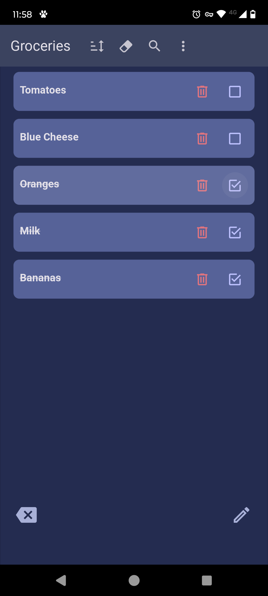
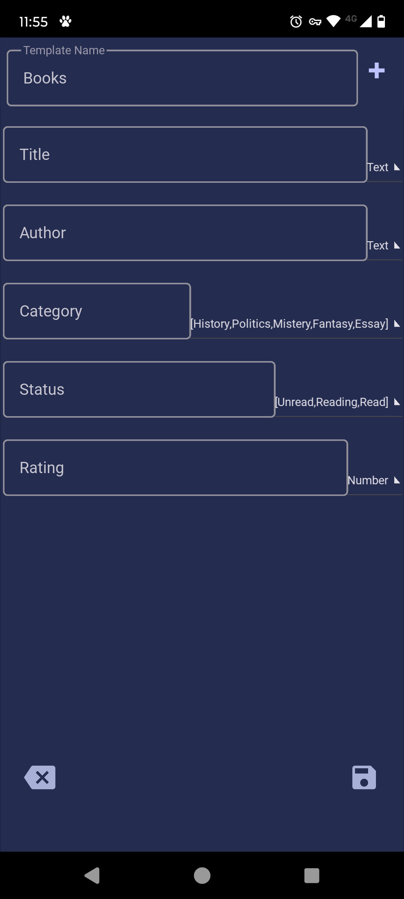
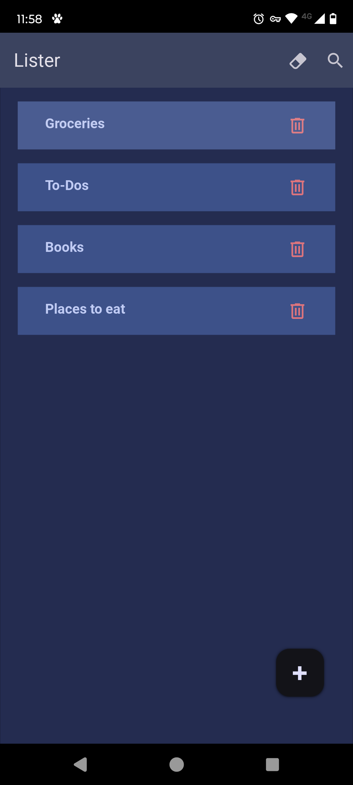
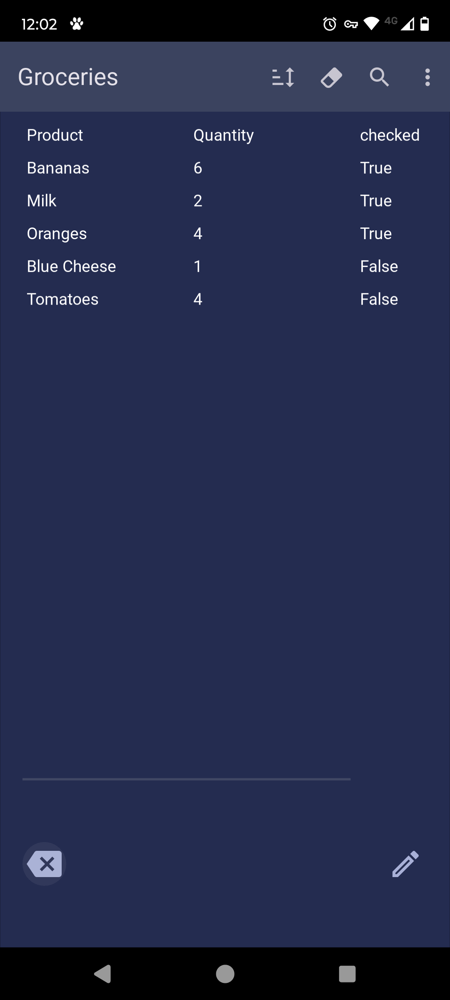
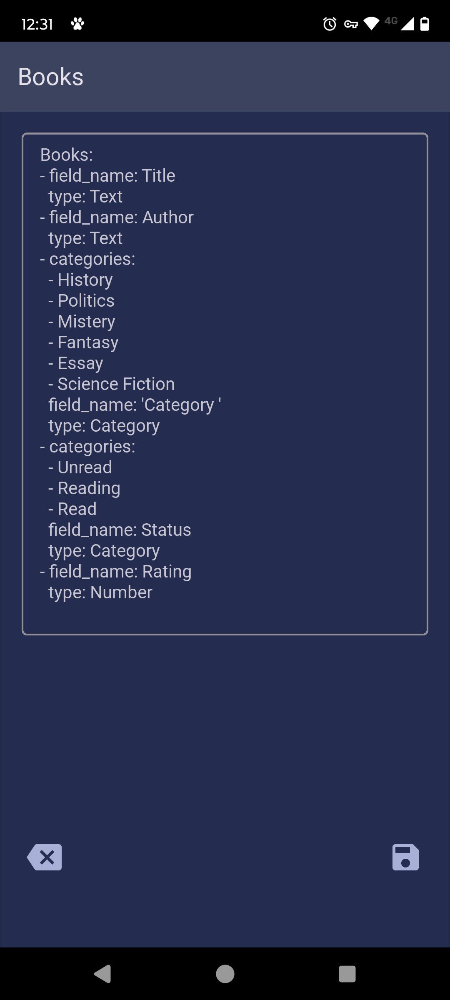
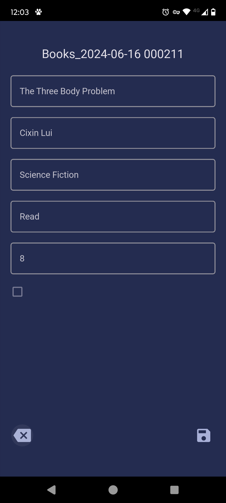

# Lister

Lister is a versatile and minimalist Android application designed to
empower users in creating personalized lists tailored to their specific needs.
Whether it's managing to-dos, organizing groceries, planning meals,
or any other list-oriented task, Lister offers a flexible and
intuitive platform for users to streamline their planning process.

Lister is the best way to keep all your list-oriented notes in a same place. 
Manage your to-do tasks, your grocery shopping list, or just write down notes 
or keep a track of those restaurants you want to try.

## Features
- **Customize template**: Users have freedom to design their lists with their 
own fields. Each template can consist of custom fields, including text,
numbers, dates, or categories, allowing for precise organization and
categorization of items.

- **Item Management**: Once a list template is established, users can begin
adding items effortlessly. Each item can be populated with data corresponding
to the defined fields, ensuring comprehensive and structured information
management. Items can be edited, archived or deleted.

- **Table View**: Each list can be managed in the default list format or viewed
in tabular format, to get a full overview of the data.

- **Plain Text**: Lister saves all data in plain text (yaml format) files. The user
data is not hidden behind a database or cloud storage and is easily accessible.

## Screenshots

<table>
  <tr>
    <td></td>
    <td></td>
  </tr>
  <tr>
    <td></td>
    <td></td>
  </tr>
  <tr>
    <td></td>
    <td></td>
  </tr>

</table>

